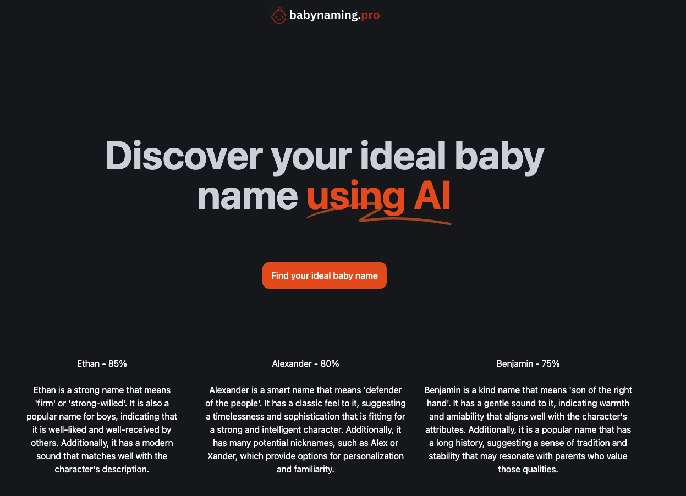
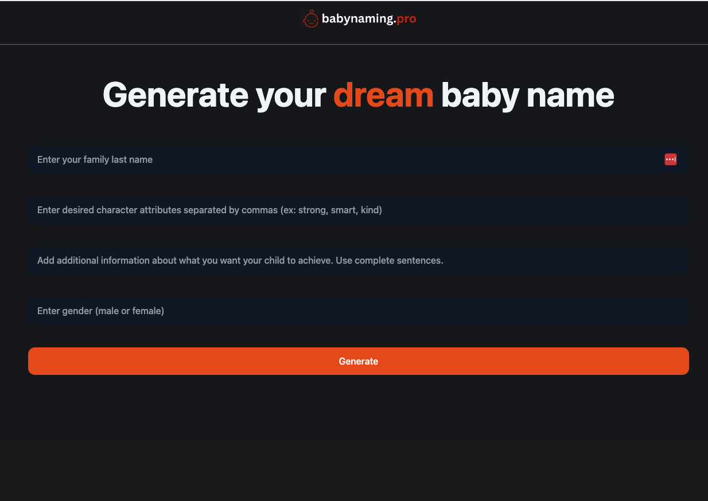
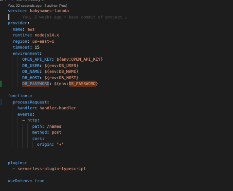
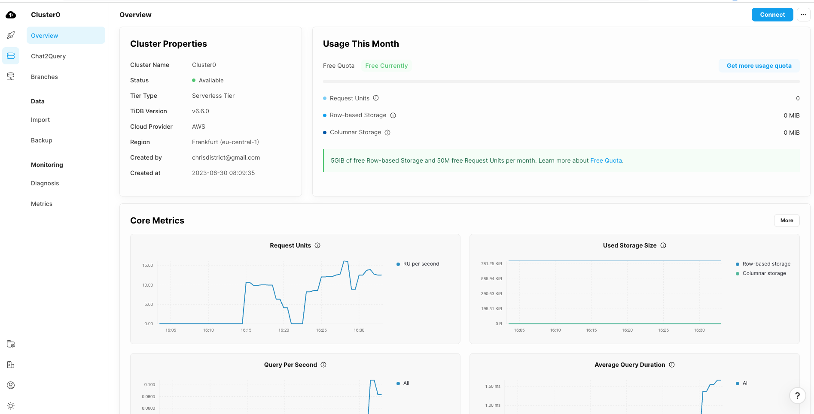
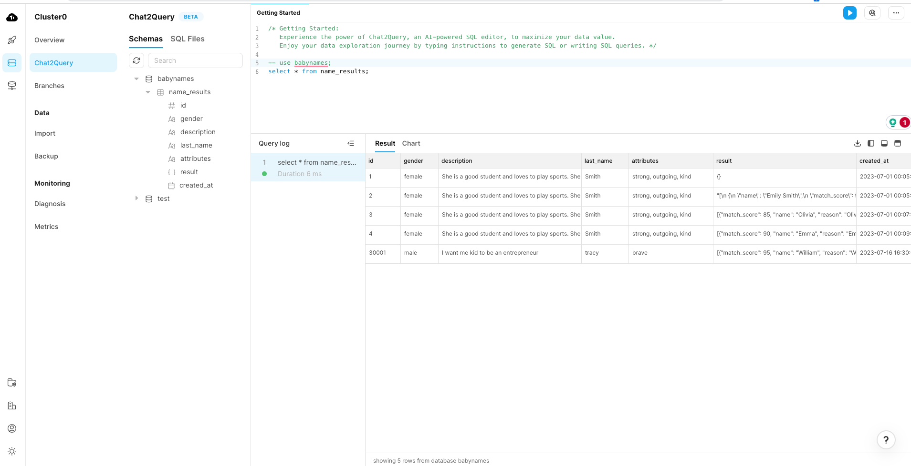

    

 
 

Babynaming.pro
---

Babynaming is a baby naming app that utilizes the capabilities of OpenAI, TiDB, and serverless functions to generate personalized and creative baby names. 

Submitted to the <a href="https://tidbhackathon2023.devpost.com/" target="_blank">TiDB Future app hackathon 2023.</a>

Demo video:

Live demo: <a href="babynaming.pro" target="_blank">babynaming</a>

## Motivation

With many expensive and disparate solutions out there, the inspiration behind Babynaming.pro came from the desire to provide parents with a modern and efficient tool for choosing the perfect name for their baby. We wanted to leverage the power of artificial intelligence, specifically OpenAI's language model, to generate unique and meaningful names based on various criteria that a potential parent could specify.

The app allows users to input specific preferences such as gender, cultural background, and desired name characteristics. It then uses OpenAI's language model to generate a list of name suggestions that meet the provided criteria. The names are further refined and ranked using TiDB, a distributed SQL database, to ensure optimal performance and scalability. Finally, the app presents the user with a curated list of potential baby names. Every submission is saved to TiDB for reporting and understanding of app usage and naming over time.

## How we built it

The app combines several technologies. The frontend of the app was developed using modern web development frameworks such as React.js and styled-components to create an intuitive and user-friendly interface. The backend utilizes serverless functions, which are deployed on a cloud platform, to handle user requests and communicate with the various components of the system. OpenAI's powerful language model is integrated into the backend to generate the name suggestions based on user preferences. To store and process the data efficiently, we leveraged TiDB, a distributed SQL database that provides scalability and high performance.

## Challenges we ran into

During the development of Babynaming.pro, we faced several challenges. Integrating OpenAI's language model into the backend and ensuring efficient communication with the frontend required careful coordination and implementation. Additionally, fine-tuning the language model to generate culturally appropriate names posed a challenge, as it required extensive training and validation to ensure the the different user inputs result in a consistent / parse-able model from the backend. TiDB is used to aggregate all the requests, and over time will create a large index of names and properties that can be reported on and analyzed in the future.

## How to run (custom)

Override env variables in .env.sample and copy to .env using your TIDB database settings.

### Server

This app uses an AWS lambda deployment. Important: the `.env` file in the `./server` folder should be filled with your values before deploy.

./server: `yarn; yarn deploy`  # yarn deploy uses the 'personal' aws profile

Note: See the command in package.json for adjustment or to use another AWS profile.

### Client

<pre>
    NEXT_PUBLIC_STRIPE_PUBLISHABLE_KEY= # optional/future: add a charging method for requests
    NEXT_PUBLIC_SERVER_URL= # required: base url for the `/server` project (currently a configured as a lambda function)
</pre>

Override env variable `NEXT_PUBLIC_SERVER_URL` with your url of the serverless/base server path.

`yarn; yarn dev`

## Screenshots

### Home page

### Creation form

### Example results (test 1)

### Example results (test 2)

### Serverless config (backend and storage)

### TiDB dashboard

### TiDB Schema and example entries

## Potential future work

1. Implement Machine Learning for Name Personalization: Explore the integration of machine learning techniques to personalize the name suggestions further. By considering factors such as user feedback, name preferences, and historical data, we can enhance the algorithm's ability to generate highly tailored and meaningful name recommendations.

2. Expand Cultural Name Databases: Extend the app's cultural name databases to include a broader range of cultural backgrounds and naming traditions. By incorporating more diverse name options, we can provide parents with a comprehensive selection of names that reflect their specific cultural heritage and preferences.

3. Enhance Name Meaning and Origin Information: Augment the app with detailed name meaning and origin information. By incorporating linguistic and historical data, we can provide users with insights into the cultural significance and symbolism behind each name. This will help parents make informed decisions and foster a deeper connection with their chosen name.

4. Social Integration and Sharing: Introduce social integration features that allow users to share their favorite name choices with friends and family. By enabling sharing options via popular social media platforms, we can facilitate discussions and gather feedback from a wider community, helping parents receive valuable input during the decision-making process.

5. Integration with Parenting Resources: Collaborate with parenting resources and platforms to integrate Babynaming.pro as a recommended tool for expecting parents. By partnering with established parenting communities, websites, or apps, we can reach a larger audience and provide comprehensive support and guidance throughout the naming process.